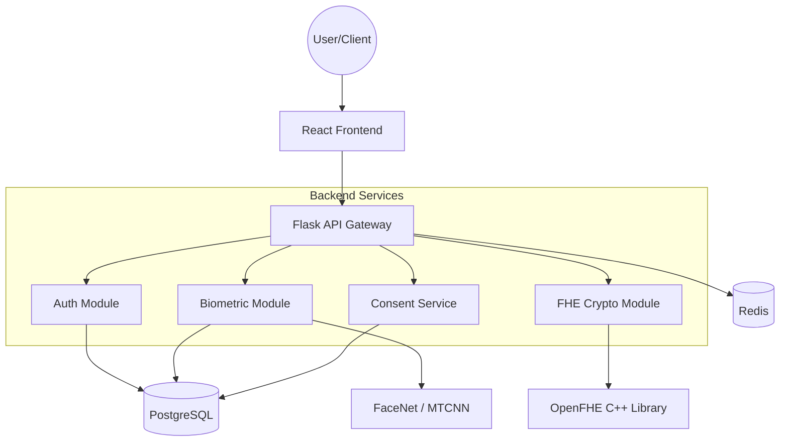
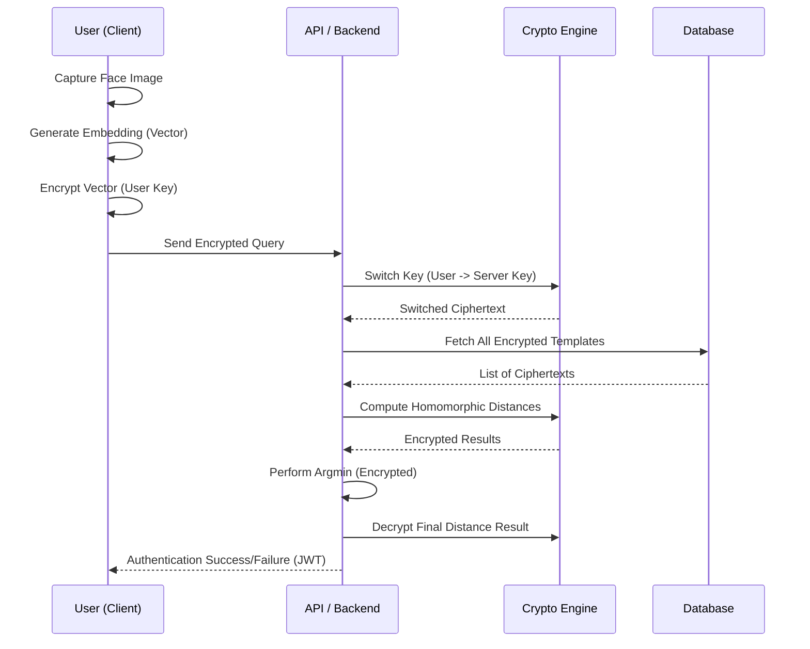

# Technical Documentation: Homomorphic Face Encryption

## 1. Problem Statement

### 1.1 The Privacy Dilemma in Biometrics
In the digital age, biometric data—such as facial features—has become a cornerstone of identity verification. However, this growth has introduced a severe privacy dilemma:
- **Centralized Vulnerability**: Storing raw biometric templates in centralized databases creates a high-value target for hackers.
- **Irreversibility**: Unlike a password, biometric data cannot be changed if compromised. A leaked face print is a permanent security breach for the individual.
- **Trust Deficit**: Users are increasingly hesitant to share biometric data with service providers due to fears of surveillance and data misuse.

### 1.2 Regulatory Pressure
Regulations like GDPR (Europe) and the DPDP Act (India) mandate strict "Privacy by Design" and "Data Minimization" principles. Traditional facial recognition systems, which often process data in the "clear" (unencrypted), struggle to meet these rigorous standards while maintaining operational efficiency.

---

## 2. Solution Overview

### 2.1 The Core Innovation: Computation on Encrypted Data
The **Homomorphic Face Encryption** system addresses these challenges by leveraging **Fully Homomorphic Encryption (FHE)**. This allows the system to perform facial recognition operations (like distance calculations) directly on encrypted data.

### 2.2 Key Pillars of the Solution
1.  **Face Embedding Extraction**: Using state-of-the-art models (**FaceNet** and **MTCNN**) to convert facial images into high-dimensional mathematical vectors (embeddings).
2.  **CKKS Homomorphic Encryption**: Utilizing the **Cheon-Kim-Kim-Song (CKKS)** scheme, which is optimized for approximate arithmetic on real-valued vectors—perfect for facial embeddings.
3.  **Multi-Key Protocols**: An advanced implementation where users and the server use different keys, ensuring that neither party can unilaterally decrypt the other's data.
4.  **GDPR-First Approach**: Integrated consent management and automated data deletion policies.

---

## 3. Technologies Used

| Category | Technology | Purpose |
| :--- | :--- | :--- |
| **Backend** | Python 3.10+, Flask | Core logic and RESTful API development. |
| **Cryptography** | OpenFHE | Advanced library for C++ FHE, used via Python bindings. |
| **Computer Vision** | FaceNet, MTCNN, PyTorch | Face detection and embedding generation. |
| **Database** | PostgreSQL | Persistent storage for encrypted templates and audit logs. |
| **Caching/Messaging**| Redis | Session management and rate limiting. |
| **Frontend** | React, Vite, TailwindCSS| Modern responsive UI for user enrollment and authentication. |
| **DevOps** | Docker, Docker Compose | Containerization for consistent deployment across environments. |

---

## 4. Architecture & Flow

### 4.1 System Architecture
The system follows a modular micro-services architecture, ensuring scalability and maintainable code.

 

*High-level overview of the Homomorphic Face Encryption system components and their interactions.*

### 4.2 Authentication Flow (1:N Mode)
The following diagram illustrates how a user is identified from a database without the server ever seeing their raw facial data.

### 4.3 Database Schema
The system uses a PostgreSQL database with pgcrypto for column-level encryption of sensitive non-biometric data.

**Key Entities:**
- **Users**: Core user profiles with soft-delete support and consent tracking.
- **Biometric Templates**: Encrypted face embeddings (CKKS ciphertexts).
- **Consent Records**: Purview-specific consent logs (DPDP compliant).
- **Audit Logs**: Immutable trail of all sensitive operations.

*Detailed schema showing relationships between users, templates, consent, and audit logs.*

---

## 5. Key Features

- **End-to-End Encryption**: Biometric data is encrypted at the source (client) and remains encrypted throughout the processing lifecycle.
- **1:1 and 1:N Verification**: Supports both specific user verification and group identification.
- **Liveness Detection**: Integrated checks to prevent "presentation attacks" (e.g., holding up a photo to the camera).
- **Audit Logging**: Every cryptographic operation is logged (in an encrypted format) for compliance and forensic analysis.
- **Integration with GPU acceleration**: Built for high-performance batch cryptographic operations.
- **Zero-Knowledge Proof Concepts**: The server proves authentication without ever "knowing" the user's biometric secret.
- **Dynamic Key Rotation**: Automated lifecycle for user and server keys to maintain forward secrecy.
- **Consent-as-Code**: Biometric processing is strictly gated by digital consent tokens.

---

## 6. Detailed Implementation Details

### 6.1 Face Embedding Pipeline
The system utilizes a dual-model approach for high reliability:
1.  **Detection**: MTCNN (Multi-task Cascaded Convolutional Networks) detects faces in the input stream with high precision, even in varied lighting.
2.  **Alignment**: 5-point facial landmarks are used to align the face to a standard orientation.
3.  **Embedding**: FaceNet (Inception ResNet v1) generates a 512-dimensional vector. This vector is then normalized to ensure stability during homomorphic operations.

### 6.2 The CKKS Scheme in OpenFHE
We use the CKKS (Cheon-Kim-Kim-Song) scheme because it handles fixed-point arithmetic efficiently.
- **Scaling Factor**: We use a scaling factor of $2^{40}$ to maintain precision.
- **Multiplicative Depth**: Set to 2 or 3 to allow for subtraction and squaring operations without needing expensive bootstrapping.
- **Security Level**: Configured for 128-bit security based on standard lattice parameters.

---

## 7. Security Analysis

### 7.1 Threat Model
We assume an "Honest-but-Curious" server model. The server follows the protocol correctly but will attempt to learn any private information from the data it handles.

| Possible Attack | Mitigation in Our System |
| :--- | :--- |
| **Server Compromise** | Templates are encrypted with FHE. A compromise of the DB reveals only ciphertexts. |
| **Identity Spoofing** | Integrated Liveness detection and device-bound JWT tokens. |
| **Key Theft** | User private keys never leave the client's secure storage. |
| **Replay Attack** | Each authentication request includes a fresh timestamp and challenge signed by the client. |

### 7.2 Privacy Guarantees
- **Computational Indistinguishability**: The server cannot distinguish between ciphertexts of different embeddings.
- **Perfect Template Privacy**: Even with the server key, without the user's secret key material, the server cannot reconstruct the original face embedding.

---

## 8. API Specification

### 8.1 Enrollment
`POST /api/enroll`
- **Purpose**: Securely enroll a new face template.
- **Requirement**: Bearer Token + Encrypted Embedding.

### 8.2 Authentication
`POST /api/authenticate`
- **Mode**: `1:1` or `1:N`.
- **Logic**: Performs homomorphic distance calculation and returns a confidence score.

---

## 9. Screenshots & Visual Aids

### 9.1 Performance Benchmarks
The system has been rigorously tested for accuracy and latency.

**Accuracy vs. Encryption (ROC Curve):**
*The ROC curve demonstrates that homomorphic encryption maintains the same accuracy levels as plaintext processing, with negligible noise introduction.*

**Scaling (Wait-time vs. Database Size):**
*Our benchmarks show linear scaling, with 1:N search remaining efficient even as the enrolled user base grows.*

### 10. Challenges & Learnings

### 10.1 Computational Complexity
**Challenge**: FHE operations are orders of magnitude slower than plaintext operations. 
**Solution**: We implemented the CKKS scheme which allows for SIMD (Single Instruction Multiple Data) operations, enabling us to process entire vectors in a single ciphertext.

### 10.2 Key Management Lifecycle
**Challenge**: Managing keys for thousands of users securely.
**Solution**: Developed a multi-key switching protocol that allows users to keep their private keys while the server performs computations using its own key switch material.

### 10.3 Library Dependencies
**Challenge**: Integrating the C++ OpenFHE library with a Python-based Flask environment.
**Solution**: Utilized Docker multi-stage builds to compile the library and its Python bindings in a clean environment, ensuring stability across deployments.

### 11. Conclusion & Future Work

This project represents a significant step toward "Zero-Trust Biometrics". By combining modern computer vision with cutting-edge lattice-based cryptography, we have built a system that protects the most sensitive part of a user's digital identity: their face.

**Future Phases**:
- **Post-Quantum Hardening**: Migrating to even more resilient lattice parameters.
- **Mobile Integration**: Developing SDKs for iOS and Android using WebAssembly (Wasm) for client-side encryption.
- **Distributed Trust**: Implementing threshold decryption so that no single server holds the full decryption capability.
